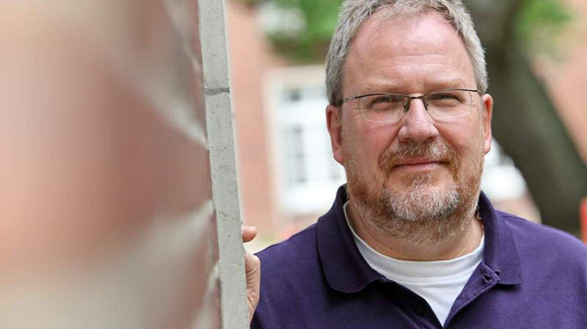

# DR. PHIL. FRANK SCHULZ-KINDERMANN

#### **Psychoonkologische Psychotherapie, Fortbildung und Supervision**

{fig-alt="Foto von Frank Schulz-Kindermann" width="90%"}

##### Diplom-Psychologe, Psychologischer Psychotherapeut (VT), Gesprächspsychotherapeut (GwG), Psychoonkologe (DKG), Supervisor (PTK)

> *„Hoffnung ist nicht die Überzeugung, dass etwas gut ausgeht, sondern die Gewissheit, dass etwas Sinn macht, egal wie es ausgeht.“ (Vaclav Havel)*
