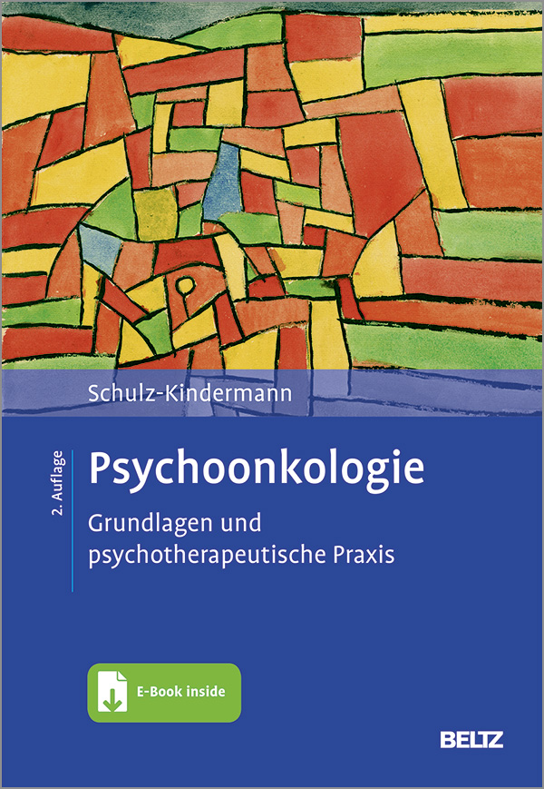

# PUBLIKATIONEN

Durch die Arbeit an den Universitätskliniken konnte ich mich meinen thematischen Schwerpunkten in der Psychoonkologie häufig in (internationalen) wissenschaftlichen Studien widmen. Meine wissenschaftlichen Publikationen finden Sie auf [ResearchGate](https://www.researchgate.net/profile/Frank-Schulz-Kindermann).

Eigene klinische Ausbildung und Erfahrung, Forschung und Lehre sowie fortwährende Supervision führten schließlich zum Verfassen eines Lehrbuches „[Psychoonkologie – Grundlagen und psychotherapeutische Praxis](https://www.beltz.de/fachmedien/psychologie/produkte/details/45248-psychoonkologie.html)“, das 2013 bei Beltz veröffentlicht wurde und 2021 in zweiter Auflage erschien:

[{fig-alt="Blue book cover of \"Psychoonkologie\", 2nd edition" fig-align="left" width="35%"}](https://www.beltz.de/fachmedien/psychologie/produkte/details/45248-psychoonkologie.html)
